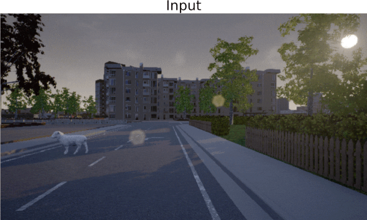

# Combined Anomalous Object Segmentation Benchmark

This repository contains the StreetHazards dataset and some code for the paper [A Benchmark for Anomaly Segmentation](https://arxiv.org/abs/1911.11132).

__[Download the StreetHazards anomaly segmentation dataset here](https://people.eecs.berkeley.edu/~hendrycks/streethazards_test.tar).__

The optional StreetHazards training set is available [here](https://people.eecs.berkeley.edu/~hendrycks/streethazards_train.tar). Also, the BDD-Anomaly dataset is sourced from the [BDD100K dataset](bdd-data.berkeley.edu). Code for the multi-label out-of-distribution detection experiments is available in [this repository](https://github.com/xksteven/multilabel-ood).

## How to use this repository

    git clone --recursive https://github.com/hendrycks/anomaly-seg

    cd anomaly-seg
    mv defaults.py semantic-segmentation-pytorch/config
    mv anom_utils.py semantic-segmentation-pytorch/
    mv dataset.py semantic-segmentation-pytorch/
    mv eval_ood.py semantic-segmentation-pytorch/
    mv create_dataset.py semantic-segmentation-pytorch/
    cd semantic-segmentation-pytorch

    # Place the above download in semantic-segmentation-pytorch/data/
    cd data/
    tar -xvf streethazards_train.tar
    cd ..
    python3 create_dataset.py
    
    # Train pspnet or another model on our dataset
    python3 train.py

    # To evaluate the model on out of distribution test set
    python3 eval_ood.py DATASET.list_val ./data/test.odgt

To evaluate the model performance using a CRF with our code please install

    pip install pydensecrf

The source package is from https://github.com/lucasb-eyer/pydensecrf 

## Evaluation with BDD100K

Within the create_dataset.py file we provide a function that converts the BDD100K labels into the labels we used for our experiments.  We have commented out the section that creates the odgt files that we used for BDD100K.  Uncommenting and running will generate the appropriate labels used for training and testing. The remaining procedure is the same as described above.

## Citation

If you find this useful in your research, please consider citing:

    @article{hendrycks2019anomalyseg,
      title={A Benchmark for Anomaly Segmentation},
      author={Hendrycks, Dan and Basart, Steven and Mazeika, Mantas and Mostajabi, Mohammadreza and Steinhardt, Jacob and Song, Dawn},
      journal={arXiv preprint arXiv:1911.11132},
      year={2019}
    }
