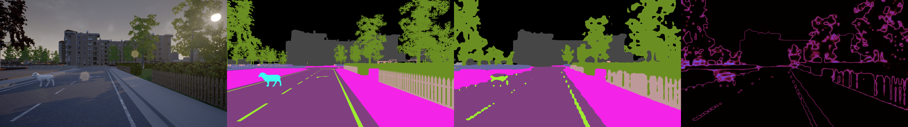

# anomaly-seg
The Combined Anomalous Object Segmentation Benchmark

The Street Hazards dataset can be downloaded from the links below.

https://people.eecs.berkeley.edu/~hendrycks/streethazards_train.tar
https://people.eecs.berkeley.edu/~hendrycks/streethazards_test.tar

The Berkeley Deep Drive 100K dataset can be downloaded from the link below.

bdd-data.berkeley.edu/

## How to use this repo

    git clone --recursive https://github.com/hendrycks/anomaly-seg

    mv defaults.py semantic-segmentation-pytorch/config
    mv anom_utils.py semantic-segmentation-pytorch/
    mv dataset.py semantic-segmentation-pytorch/
    mv eval_ood.py semantic-segmentation-pytorch/
    mv create_dataset.py semantic-segmentation-pytorch/
    cd semantic-segmentation-pytorch

    # Place the above download in semantic-segmentation-pytorch/data/
    # Train pspnet or another model on our dataset
    python3 train.py

    # To evaluate the model on out of distribution test set
    python3 eval_ood.py --DATASET.list_val ./data/test.odgt

Note: To evaluate the model performance using a CRF with our code please install

    pip install pydensecrf

The source package is from https://github.com/lucasb-eyer/pydensecrf 

## Evaluation with BDD100K

Within the create_dataset.py file we provide a function that converts the BDD100K labels into the labels we used for our experiments.  We have commented out the section that creates the odgt files we used for BDD100K.  Uncommenting and running will generate the appropriate labels used for training and testing. The remaining procedure is the same as described above.

## Citation

If you find this useful in your research, please consider citing:

    @article{hendrycks2019anomalyseg,
      title={A Benchmark for Anomaly Segmentation},
      author={Hendrycks, Dan and Basart, Steven and Mazeika, Mantas and Mostajabi, Mohammadreza and Steinhardt, Jacob and Song, Dawn},
      journal={arXiv preprint arXiv:},
      year={2019}
    }
